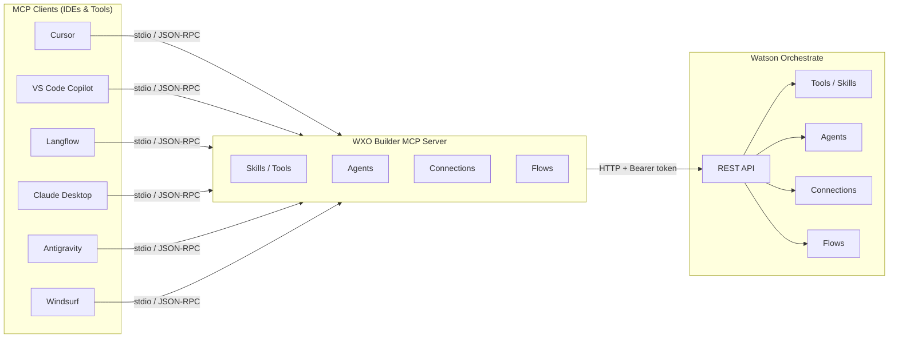
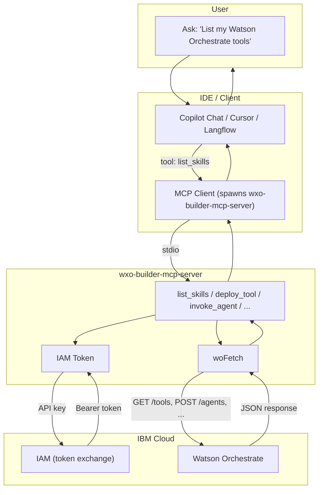

# WXO Builder MCP Server – Documentation

**Version:** 1.0.12  
**Author:** Markus van Kempen  
**License:** Apache-2.0

---

## Contents

- [Architecture](#architecture) – MCP as proxy, data flow, supported clients
- [Overview](#overview) – Purpose and comparison with wxo-agent-mcp
- [Project Structure](#project-structure)
- [Configuration](#configuration)
- [MCP Tools](#mcp-tools)
- [Question Examples](#question-examples)
- [Verification](#verification)
- [Running the Server](#running-the-server)
- [Testing in VS Code](#testing-locally-in-vs-code)
- [Testing in Langflow](#testing-in-langflow)
- [Troubleshooting](#troubleshooting)
- [API Dependencies](#api-dependencies)
- [License](#license)

---

## Architecture

### MCP as Proxy to Watson Orchestrate

WXO Builder MCP Server acts as a **proxy** between MCP-enabled clients (IDEs, AI assistants, flow builders) and IBM Watson Orchestrate. Clients communicate via **MCP over stdio** (JSON-RPC); the MCP server translates tool calls into Watson Orchestrate REST API requests.



### Data Flow



### Supported Clients

| Client              | Config                       | Transport |
| ------------------- | ---------------------------- | --------- |
| **Cursor**          | `.cursor/mcp.json`           | stdio     |
| **VS Code Copilot** | `.vscode/mcp.json`           | stdio     |
| **Langflow**        | MCP Tools component (STDIO) | stdio     |
| **Claude Desktop**  | `claude_desktop_config.json` | stdio     |
| **Antigravity**     | MCP servers config           | stdio     |
| **Windsurf**        | `~/.codeium/windsurf/mcp_config.json` | stdio |

All clients spawn the MCP server as a subprocess and communicate via **stdio** (stdin/stdout) using the MCP JSON-RPC protocol.

### Tool → API Mapping (summary)

| MCP Tool Category | Watson Orchestrate API |
| ----------------- | ---------------------- |
| Skills (Tools)    | `GET/POST/PUT/DELETE /v1/orchestrate/tools`, `POST .../tools/{id}/upload`, `GET .../tools/{id}/download` |
| Agents           | `GET/POST/PATCH/PUT/DELETE /v1/orchestrate/agents`, `GET/PUT .../chat-starter-settings` |
| Connections      | `GET/POST/DELETE /v1/orchestrate/connections/applications`, `PATCH .../runtime_credentials` |
| Flows            | `GET/POST/DELETE /v1/flows/`, `GET/DELETE /v1/flows/{id}` |
| Runs             | `POST /v1/orchestrate/runs`, `GET .../threads/{id}/messages` |

---

## Overview

**WXO Builder MCP Server** is a full-featured MCP (Model Context Protocol) server for IBM Watson Orchestrate. It exposes 30+ tools to manage tools/skills, agents, connections, and flows. Use it from Cursor, VS Code Copilot, Claude Desktop, Langflow, Antigravity, and Windsurf.

### Purpose

- **Tools (Skills)** – List, create, deploy, copy, update, delete. Deploy from OpenAPI spec, from URL (public or with API key), or from Python tool-spec.json.
- **Agents** – List, create, update, invoke, assign tools, manage chat starter settings.
- **Connections** – List, create, delete, configure credentials (api_key, basic, bearer).
- **Flows** – List, create, get, delete.
- **Execution** – Execute tools remotely via agentic runs; invoke agents; test URLs locally.

### Compared to wxo-agent-mcp

| Aspect       | wxo-agent-mcp                          | wxo-builder-mcp-server                        |
| ------------ | -------------------------------------- | --------------------------------------------- |
| Purpose      | Chat with one agent                    | Full dev toolkit                              |
| Agent config | Single `WO_AGENT_ID` or `WO_AGENT_IDs` | Multiple agents, `WO_AGENT_IDs`               |
| Tools        | 2 (`invoke_agent`, `get_agent`)        | 30+ (list_skills, deploy_tool, create_python_tool, etc.) |
| Use case     | "Ask my agent"                         | Build and manage Watson Orchestrate resources |
| Python tools | No                                     | Yes: create from tool-spec.json, upload artifact, download |

---

## Project Structure

```
wxo-builder-mcp-server/
├── src/
│   ├── index.ts       # MCP server, tool handlers
│   ├── auth.ts        # IAM token, woFetch for Watson Orchestrate API
│   ├── config.ts      # Env loading, WO_* config, URL normalization
│   ├── skills.ts      # Tools/skills: list, deploy, copy, execute, Python tools
│   ├── agents.ts      # Agents: list, create, invoke, assign tools
│   ├── connections.ts # Connections: list, create, configure credentials
│   ├── flows.ts       # Flows: list, create, get, delete
│   └── models.ts      # LLM models list
├── tests/
│   ├── test-questions.ts      # User-style test questions for integration
│   ├── integration-mcp-parity.ts  # Integration test runner
│   └── README.md
├── examples/
│   ├── .cursor/mcp.json
│   ├── .vscode/mcp.json
│   ├── claude-desktop-config.json
│   ├── antigravity-mcp-config.json
│   ├── windsurf-mcp-config.json
│   └── env.example
├── watson-orchestrate-openapi.json  # OpenAPI spec for Watson Orchestrate API
├── package.json
├── tsconfig.json
├── .env.example
├── README.md
├── DOCUMENTATION.md
├── CHANGELOG.md
├── CONTRIBUTING.md
└── LICENSE
```

### Source Files

| File               | Role                                                                                                                                 |
| ------------------ | ------------------------------------------------------------------------------------------------------------------------------------ |
| **src/index.ts**   | MCP server setup, registers all tools (skills, agents, connections, flows). Uses Zod for input validation.                             |
| **src/auth.ts**    | IAM token acquisition (IBM Cloud API key → Bearer token), `woFetch` for authenticated requests to Watson Orchestrate.               |
| **src/config.ts**  | Loads `.env`, normalizes `WO_INSTANCE_URL`, resolves `WO_AGENT_ID` or `WO_AGENT_IDs` (first ID used as default).                    |
| **src/skills.ts**  | Tools/skills: list, get, delete, deploy (OpenAPI, URL, Python), copy, update, execute, download artifact, test local URL.           |
| **src/agents.ts**  | Agents: list, get, create, update, delete, invoke, assign tools, list agent tools, chat starter settings, ensure test agent.        |
| **src/connections.ts** | Connections: list, create, delete, configure credentials (api_key, basic, bearer).                                           |
| **src/flows.ts**   | Flows: list, create, get, delete (via `/v1/flows/`).                                                                                  |
| **src/models.ts**  | List available LLM models for agents.                                                                                                |

---

## Configuration

### Environment Variables

| Variable            | Required                          | Description                                                                                                                                          |
| ------------------- | --------------------------------- | ---------------------------------------------------------------------------------------------------------------------------------------------------- |
| **WO_API_KEY**      | Yes                               | IBM Cloud API key for Watson Orchestrate.                                                                                                            |
| **WO_INSTANCE_URL** | Yes                               | Watson Orchestrate instance URL (e.g. `https://api.us-south.watson-orchestrate.cloud.ibm.com/instances/{id}` or `https://{id}.orchestrate.ibm.com`). |
| **WO_AGENT_ID**     | Optional (for agent tools)        | Default agent ID when user omits agent_id/agent_name.                                                                                                |
| **WO_AGENT_IDs**    | Optional (for agent tools)         | Comma-separated agent IDs; first is used as default.                                                                                                 |
| **IAM_TOKEN_URL**   | No                                | Default `https://iam.cloud.ibm.com/identity/token`. Override for private IAM.                                                                          |

### Configuration Sources

1. `.env` in the project root.
2. `.env` in the current working directory.
3. MCP client `env` block (e.g. in Cursor `mcp.json`).
4. Shell environment variables.

---

## MCP Tools

### Skills (Tools)

| Tool | Description |
| ---- | ----------- |
| **get_api_spec** | Get Watson Orchestrate OpenAPI spec (full or summary). |
| **list_skills** | List all tools in the catalog. |
| **list_tools_with_connections** | List tools grouped by connection status. |
| **list_standard_tools** | List only tools with no connections. |
| **get_skill** | Get a tool by ID. |
| **delete_skill** | Delete a tool. |
| **deploy_skill** | Create a tool from OpenAPI spec. Set `x-ibm-connection-id` to bind a connection. |
| **deploy_tool_from_url** | Create a tool from a URL (public or with API key; auto-creates connection when needed). |
| **create_python_tool_from_tool_spec_json** | Create a Python tool from tool-spec.json content plus python_code and requirements. |
| **create_python_tool_and_upload** | Create a Python tool and upload its artifact in one step. |
| **upload_python_tool_artifact** | Upload Python artifact ZIP to an existing tool. |
| **download_tool_artifact** | Download tool artifact ZIP (Python source). |
| **update_skill** | Update name, description, permission. |
| **copy_skill** | Copy a tool with optional new name. |
| **execute_tool** | Execute a tool by name or ID via agentic runs. |
| **assign_tool_to_agent** | Assign a tool to an agent. |
| **create_tool_and_assign_to_agent** | Create a tool from URL and assign to agent in one step. |
| **test_tool_local** | Test an API endpoint locally (direct HTTP GET). |

### Agents

| Tool | Description |
| ---- | ----------- |
| **list_agents** | List all agents. |
| **get_agent** | Get agent by ID or name. |
| **create_agent** | Create an agent. |
| **update_agent** | Update an agent. |
| **delete_agent** | Delete an agent. |
| **invoke_agent** | Chat with an agent. |
| **list_agent_tools** | List tools assigned to an agent. |
| **get_agent_chat_starter_settings** | Get welcome message and quick prompts. |
| **update_agent_chat_starter_settings** | Update welcome message and quick prompts. |
| **update_agent_instructions_from_tools** | Auto-generate instructions from assigned tools. |

### Connections

| Tool | Description |
| ---- | ----------- |
| **list_connectors** | List available connector catalog. |
| **list_connections** | List configured connections (scope: draft, live, all). |
| **list_active_live_connections** | List only active and live connections, deduplicated. |
| **get_connection** | Get connection by app_id. |
| **create_connection** | Create a connection entry. |
| **delete_connection** | Delete a connection. |
| **configure_connection** | Set credentials (api_key, basic, bearer). |

### Flows

| Tool | Description |
| ---- | ----------- |
| **list_flows** | List all flows. |
| **get_flow** | Get a flow by ID. |
| **create_flow** | Create a flow. |
| **delete_flow** | Delete a flow. |

---

## Question Examples

Example questions to ask in **Cursor**, **VS Code Copilot**, **Langflow**, or other MCP clients. The AI will call the appropriate tools to respond.

### Tools (Skills)

| Question | Tools invoked |
| -------- | ------------- |
| List my Watson Orchestrate tools | `list_skills` or `list_tools_with_connections` |
| List tools with active connections | `list_tools_with_connections` |
| List standard tools (no connections) | `list_standard_tools` |
| Create a tool from this URL: https://restcountries.com/v3.1/name/canada | `deploy_tool_from_url` |
| Create a tool from this tool-spec.json | `create_python_tool_from_tool_spec_json` |
| Copy MVKWeather and name it MVKWeatherV2 | `copy_skill` |
| Execute MVKWeather with q=Toronto | `execute_tool` |
| Assign REST Countries to TimeWeatherAgent | `assign_tool_to_agent` |
| Create REST Countries from URL and assign to TimeWeatherAgent | `create_tool_and_assign_to_agent` |
| Download the Python source for tool X | `download_tool_artifact` |

### Agents

| Question | Tools invoked |
| -------- | ------------- |
| Which agents do I have? | `list_agents` |
| What tools does TimeWeatherAgent have? | `list_agent_tools` |
| Ask TimeWeatherAgent: What is the weather in Toronto? | `invoke_agent` |
| Create an agent named MyAgent with instructions... | `create_agent` |
| Update agent instructions from its tools | `update_agent_instructions_from_tools` |

### Connections

| Question | Tools invoked |
| -------- | ------------- |
| List all connections which are active and live | `list_active_live_connections` |
| List configured connections | `list_connections` |
| Configure API key for connection X | `configure_connection` |

### Flows

| Question | Tools invoked |
| -------- | ------------- |
| List my flows | `list_flows` |
| Get flow by ID | `get_flow` |
| Create a flow from this JSON | `create_flow` |

---

## Verification

The `test:integration` script runs **user-style test questions** against your Watson Orchestrate instance to validate MCP parity with the WxO Builder VS Code extension.

### Usage

```bash
# With WO credentials (runs all tests)
WO_API_KEY=... WO_INSTANCE_URL=... npm run test:integration

# Without WO credentials (runs local execution test only)
npm run test:integration
```

### Test Questions

Tests are defined in `tests/test-questions.ts`. Current coverage includes:

- List live connections | Copy tool | List standard tools
- Create MVKWeather from URL | Execute locally/remotely
- Agent chat (Toronto weather) | Exchange rate (TimeWeatherAgent)
- Create REST Countries and assign to TimeWeatherAgent | List agent tools
- Create tool from tool-spec.json (CreatingZipFileBasedonDocuments)
- Agent Conversation ZIP | Download tool artifact

### Requirements

- `WO_API_KEY` and `WO_INSTANCE_URL` for Watson Orchestrate tests.
- Some tests require specific tools/agents (e.g. MVKWeather, TimeWeatherAgent); they skip if not found.

---

## Running the Server

### Local

```bash
npm install
npm run build
node dist/index.js
```

The server runs on stdio. MCP clients spawn it as a subprocess and communicate via JSON-RPC.

### MCP Client Config

**Cursor** (`.cursor/mcp.json`):

```json
{
    "mcpServers": {
        "watsonx": {
            "command": "npx",
            "args": ["-y", "wxo-builder-mcp-server"],
            "env": {
                "WO_API_KEY": "your-key",
                "WO_INSTANCE_URL": "https://xxx.orchestrate.ibm.com",
                "WO_AGENT_IDs": "agent-id-1,agent-id-2"
            }
        }
    }
}
```

**VS Code Copilot** (`.vscode/mcp.json`):

```json
{
    "servers": {
        "watsonx": {
            "type": "stdio",
            "command": "npx",
            "args": ["-y", "wxo-builder-mcp-server"],
            "env": {
                "WO_API_KEY": "...",
                "WO_INSTANCE_URL": "https://...orchestrate.ibm.com"
            }
        }
    }
}
```

---

## Testing Locally in VS Code

This section assumes the MCP server is named **`watsonx`** in `mcp.json`.

### 1. Setup

1. Open the `wxo-builder-mcp-server` folder in VS Code (or the devkit root).
2. Ensure `.env` has `WO_API_KEY`, `WO_INSTANCE_URL`, and optionally `WO_AGENT_IDs`.
3. Run `npm run build` so `dist/index.js` exists.
4. Ensure `.vscode/mcp.json` contains:

```json
{
    "servers": {
        "watsonx": {
            "type": "stdio",
            "command": "node",
            "args": ["${workspaceFolder}/packages/wxo-builder-mcp-server/dist/index.js"],
            "envFile": "${workspaceFolder}/packages/wxo-builder-mcp-server/.env"
        }
    }
}
```

Or use `npx` with the package path.

### 2. Verification (terminal)

```bash
cd packages/wxo-builder-mcp-server
npm run test:integration
```

### 3. Invoking in Copilot Chat

1. Open **Copilot Chat** (View → Copilot Chat, or `Ctrl+Shift+I`).
2. On first use, VS Code may prompt to trust the MCP server; approve it.
3. The `watsonx` tools become available when the server is connected.

**Example prompts:**

| Prompt | Effect |
| ------ | ------ |
| List my Watson Orchestrate tools | `list_skills` or `list_tools_with_connections` |
| Which agents do I have? | `list_agents` |
| Create a tool from https://restcountries.com/v3.1/name/canada | `deploy_tool_from_url` |
| Ask TimeWeatherAgent: What is the weather in Toronto? | `invoke_agent` |
| Which tools are assigned to TimeWeatherAgent? | `list_agent_tools` |

---

## Testing in Langflow

Langflow can use the **wxo-builder-mcp-server** via the MCP Tools component (STDIO mode). Node.js must be installed.

### Setup

1. Build the server: `npm run build` (produces `dist/index.js`).
2. Open Langflow and create or open a flow.
3. Add an **MCP Tools** component.
4. Click **Add MCP Server** and choose **STDIO**.
5. Configure:

| Field                     | Value                                                                                 |
| ------------------------- | ------------------------------------------------------------------------------------- |
| **Name**                  | `watsonx`                                                                             |
| **Command**               | `npx`                                                                                 |
| **Arguments**             | `["-y", "wxo-builder-mcp-server"]`                                                    |
| **Environment Variables** | `WO_API_KEY`, `WO_INSTANCE_URL`, `WO_AGENT_IDs` (optional) as key-value pairs         |

6. Enable **Tool mode** in the MCP Tools component.
7. Connect MCP Tools **Toolset** port to an **Agent** component **Tools** port.
8. Add **Chat Input** and **Chat Output** if needed.

### Example prompts

- _List my Watson Orchestrate tools_
- _Create a tool from https://restcountries.com/v3.1/name/canada_
- _Which agents do I have?_
- _Ask TimeWeatherAgent: What is the weather in London?_

### Troubleshooting

- **500 Internal Server Error:** Tool output is flattened for Langflow's DataFrame. Ensure Node.js is installed; use absolute path to `dist/index.js` if using local build; set env vars in MCP config.
- **Node.js in Docker:** If Langflow runs in Docker, Node.js must be installed in the image.
- **Env vars:** Add `WO_API_KEY`, `WO_INSTANCE_URL` to Langflow's `.env` if not set in the UI.

---

## Troubleshooting

| Symptom                                  | Cause                     | Fix                                                                     |
| ---------------------------------------- | ------------------------- | ----------------------------------------------------------------------- |
| `Missing required environment variables` | Missing env vars          | Set `WO_API_KEY`, `WO_INSTANCE_URL`.                                   |
| `URL scheme "ttps" is not supported`     | Typo in `WO_INSTANCE_URL` | Use `https://` or rely on auto-correction.                              |
| `IAM failed`                             | Invalid API key           | Verify `WO_API_KEY` and regenerate if needed.                           |
| `Process exited with code 2`             | Server crash on start      | Check `.env`; run `node dist/index.js` manually to see errors.         |
| `401 Unauthorized`                       | Insufficient permissions  | Watson Orchestrate requires Manager or Administrator role for most ops. |
| `Tool not found`                         | Invalid tool/agent ID     | Use `list_skills` or `list_agents` to get valid IDs.                    |
| `403 Forbidden` on tool assignment       | API restriction           | Use `assign_tool_to_agent` (PATCH tool_ids) rather than full PUT.      |

---

## API Dependencies

- **Watson Orchestrate** (HTTP REST):
    - `GET/POST/PUT/PATCH/DELETE /v1/orchestrate/tools` – tools/skills CRUD
    - `POST /v1/orchestrate/tools/{id}/upload` – upload artifact (OpenAPI or Python ZIP)
    - `GET /v1/orchestrate/tools/{id}/download` – download artifact
    - `GET/POST/PATCH/PUT/DELETE /v1/orchestrate/agents` – agents CRUD
    - `GET/PUT /v1/orchestrate/agents/{id}/chat-starter-settings`
    - `POST /v1/orchestrate/runs` – start run (invoke agent, execute tool)
    - `GET /v1/orchestrate/threads/{id}/messages` – poll for run result
    - `GET/POST/DELETE /v1/orchestrate/connections/applications` – connections
    - `PATCH /v1/orchestrate/connections/applications/{id}/configs/{env}/runtime_credentials`
    - `GET/POST/DELETE /v1/flows/` – flows
- **IBM Cloud IAM** – exchange API key for Bearer token.

---

## License

Apache-2.0. See [LICENSE](LICENSE).
